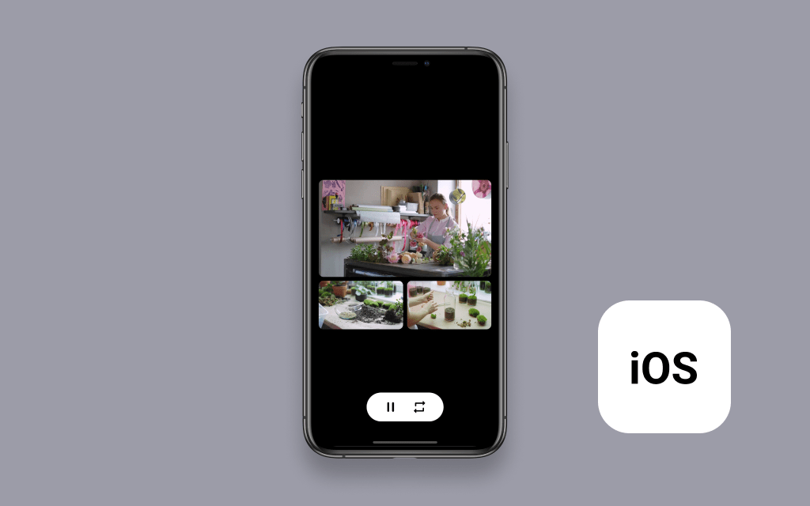

# Amazon IVS Multiple Players iOS Demo

This repository contains demo app which shows how to instantiate multiple players simultaneously, and switch between 3 predefined layouts/sets of demo streams using SwiftUI.

## Setup

1. Clone the repository to your local machine.
2. Install the SDK dependency using CocoaPods. This can be done by running the following commands from the repository folder:
   * `bundle install`
   * `bundle exec pod install`
   * For more information about these commands, see [Bundler](https://bundler.io/) and [CocoaPods](https://guides.cocoapods.org/using/getting-started.html).
3. Open `MultiplePlayers-SwiftUI.xcworkspace`.
4. You can now build and run the projects in the simulator.

## License
This project is licensed under the MIT-0 License. See the LICENSE file.
